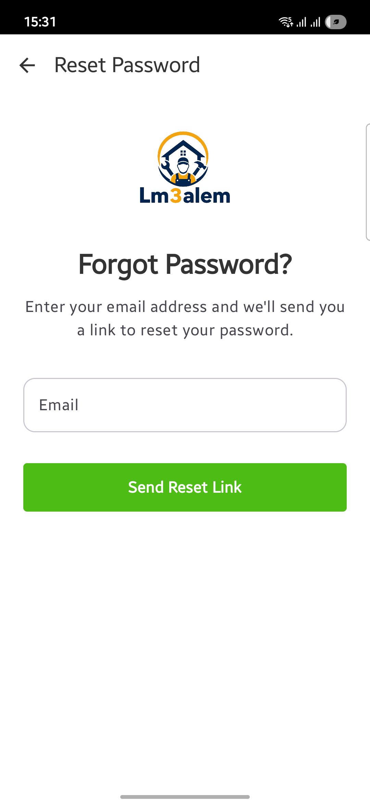
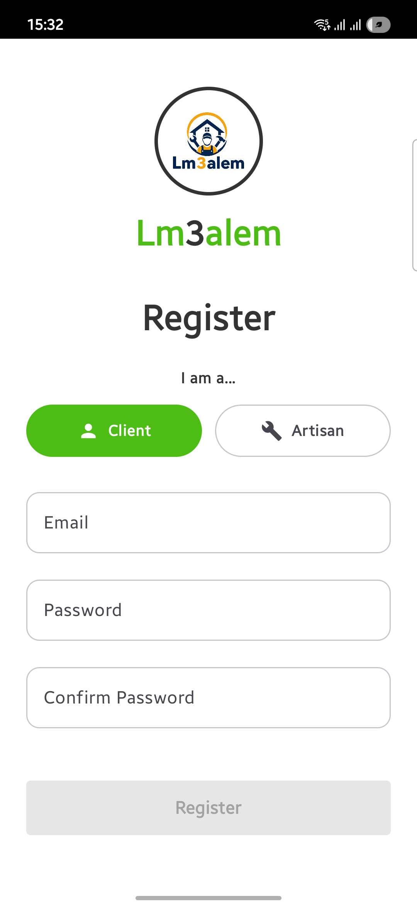
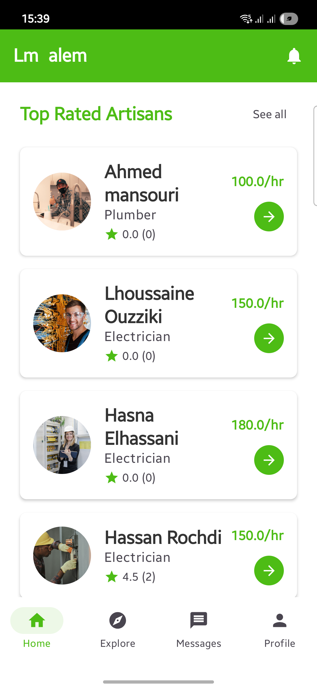
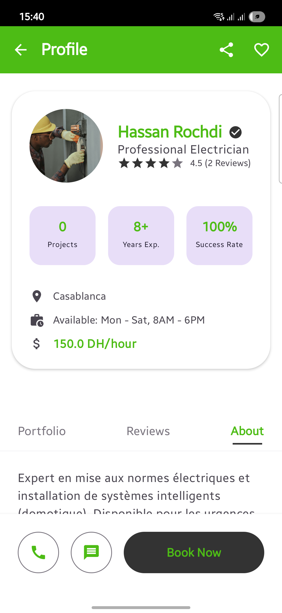
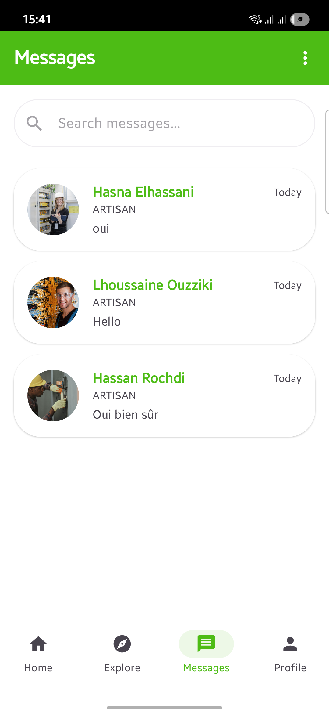
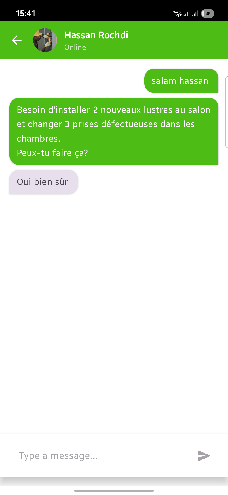
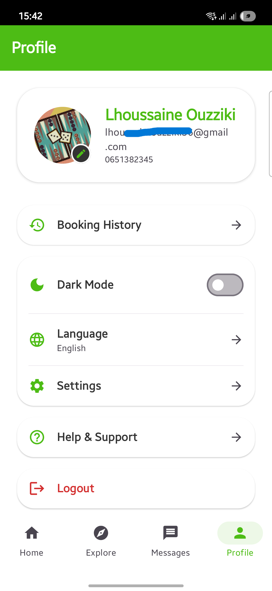
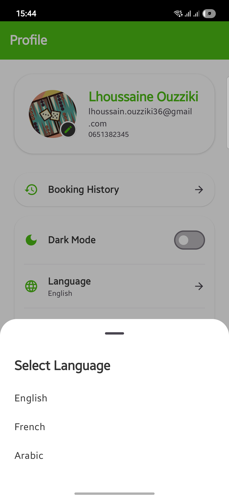

# Lm3alem (المعلم) 🛠️

**Lm3alem** est une plateforme mobile innovante conçue pour connecter instantanément les artisans et ouvriers qualifiés avec des clients ayant besoin de services de maintenance, de réparation ou de construction.

---

## 👥 Équipe du Projet
*   **HASNA ELHASSANI**
*   **OUZZIKI LHOUSSAINE**

---

## 📝 Description du Projet
L'application vise à simplifier la recherche de professionnels de confiance au Maroc. Que vous soyez un client cherchant un plombier en urgence ou un artisan souhaitant digitaliser son activité, **Lm3alem** offre une interface intuitive pour gérer ces interactions de bout en bout.

### Fonctionnalités Principales
*   **Authentification Sécurisée :** Connexion via Email/Mot de passe ou Google Sign-In.
*   **Gestion des Rôles :** Inscription distincte pour les **Clients** et les **Artisans**.
*   **Exploration et Recherche :** Filtres par métier (Plombier, Électricien, Peintre, etc.) et par ville.
*   **Profils Détaillés :** Consultation de l'expérience, des tarifs, des photos de projets et des avis clients.
*   **Système de Demandes :** Envoi et gestion de demandes de services en temps réel.
*   **Évaluations et Avis :** Système de notation pour garantir la qualité des prestations.
*   **Tableau de Bord Artisan :** Gestion du profil professionnel et suivi des demandes reçues.

---

## 📱 Interfaces Utilisateur

### 1. Authentification et Profil
L'application propose un flux d'inscription fluide permettant de choisir son rôle dès le départ.

| Connexion | Inscription | Choix du Rôle | Profil |
| :---: | :---: | :---: | :---: |
|  |  |  |  |

### 2. Expérience Client
Une interface riche et intuitive pour trouver le bon professionnel.

| Accueil | Exploration | Détails Artisan | Réservation |
| :---: | :---: | :---: | :---: |
|  |  |  |  |

| Historique | Notifications |
| :---: | :---: |
|  |  |

### 3. Expérience Artisan
Des outils dédiés pour gérer son activité professionnelle.

| Dashboard | Messagerie | Chat |
| :---: | :---: | :---: |
|  |  |  |

---

## 🏗️ Architecture du Projet
Le projet suit les principes de la **Clean Architecture** combinée au pattern **MVVM (Model-View-ViewModel)** pour garantir un code testable, maintenable et évolutif.

```text
[ UI Layer (Compose) ] <---> [ ViewModel (StateFlow) ] <---> [ Repository ] <---> [ Data Sources (Firebase/DataStore) ]
```

*   **View :** Définie avec Jetpack Compose (UI déclarative).
*   **ViewModel :** Gère l'état de l'interface et la logique métier.
*   **Repository :** Abstraction des sources de données (Firestore, Auth).
*   **Hilt :** Utilisé pour l'injection de dépendances à travers toutes les couches.

---

## 🚀 Dépendances et Technologies
L'application utilise les dernières technologies recommandées par Google :
*   **Langage :** Kotlin
*   **UI :** Jetpack Compose (Material Design 3)
*   **Navigation :** Compose Navigation
*   **Base de données & Auth :** Firebase (Firestore, Auth)
*   **Injection de Dépendances :** Hilt (Dagger)
*   **Images :** Coil (Chargement asynchrone)
*   **Données Locales :** Jetpack DataStore (Preferences)

---

## 🛠️ Installation
```bash
git clone https://github.com/ouzzikilhoussaine/Lm3alem.git
cd Lm3alem
# Ouvrez le projet dans Android Studio et synchronisez avec Gradle.
```
